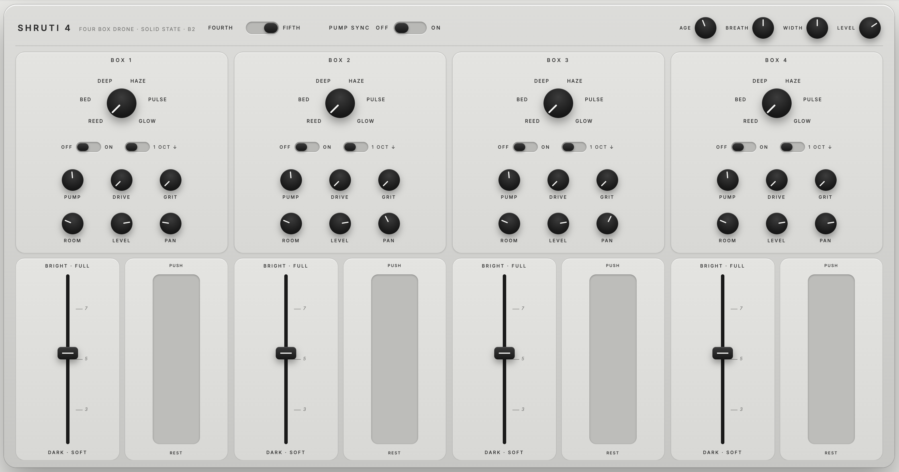

# Shruti 4

A four-box drone instrument that a newcomer cannot play wrong, built in plain HTML and Web Audio, on its way to becoming a physical device.

**Play it:** https://ianpilon.github.io/shruti-4/shruti-panel.html

Open any file directly in a browser. No build, no server, no dependencies.

## The instrument

- `shruti-panel.html` – the hardware-true panel. Four boxes, each a voice (shruti reed or one of five pad voices: Bed, Deep, Haze, Pulse, Glow) behind a bellows. Every control is a physical part: rotary voice switch, off/on and octave toggles, six knobs, a long fader and a squeeze ribbon per box; Fourth/Fifth and Pump Sync switches plus Age, Breath, Width and Level in the header. No presets, no lights: the panel is the sound.
- `shruti-panel-70s.html` – the same instrument in a brushed-aluminium and walnut tape-deck finish.
- `shruti-quartet-v2.html` – the tablet version, with presets and live readouts.

## How it got here

- `index.html` – a dependency-free rebuild of a classic online tone generator, with a live oscilloscope.
- `drones.html` – eight ways a tone becomes a drone, each a live patch.
- `shruti.html`, `shruti-mini.html`, `shruti-rocker.html`, `shruti-quartet.html` – the steps from a full shruti box to the four-box panel.
- `atmosphere.html` – a synthesized study of commercial ambient pad loops, built from spectral measurements rather than samples. The measured loops themselves are not in this repo.

Home is fixed at B2. The only intervals offered are the fourth and the fifth, so nothing can clash.

## Building the physical device

The web panel is the reference design for a hardware instrument. The plan lives in `docs/`:

- [`docs/HARDWARE.md`](docs/HARDWARE.md) – parts list, panel layout, electronics (muxes, ladders, microcontroller), and the three build phases: tablet, hybrid panel over USB MIDI, standalone box.
- [`docs/CONTROL-MAP.md`](docs/CONTROL-MAP.md) – every control, its range and curve, and its MIDI CC number and channel.
- [`docs/ENGINE.md`](docs/ENGINE.md) – the sound engine in full, constants included, so it can be ported to C++.
- [`docs/firmware/shruti4_controller/`](docs/firmware/shruti4_controller/) – a starter Arduino sketch (Raspberry Pi Pico or Teensy) that reads the panel and sends it as USB MIDI.
